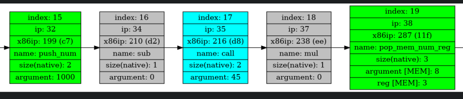

# JIT-компилятор
## Введение
Этот проект является развитием [моего языка программирования](https://github.com/Waloid24/Language). Измерив время выполнения байт-кода, который сгенерировал [виртуальный процессор](https://github.com/Waloid24/Processor), мы обнаружили острую необходимость в оптимизациях. Решением стал JIT-компилятор. Идея проекта заключается в том, чтобы перевести мой байт-код в машинные инструкции и уже их отдать на исполнение. Это даёт колоссальный прирост производительности, оцените сами, мы прикрепили измерения в конце этого отчёта!

## Запуск программы
Чтобы запустить проект на свой машине, клонируйте себе репозиторий:
```
git clone git@github.com:Waloid24/JIT.git
```
Затем скомпилируйте проект с помощью Makefile:
```
make compile
```
После этого запустите программу:
```
make run ./tests/[executable_file_name]
```
Примеры готовых к передачи в качестве параметра файлов расположены [здесь](https://github.com/Waloid24/JIT/tree/main/tests). Вы можете написать на [моём языке](https://github.com/Waloid24/Language) программу, исполнить её, созданный файл с расширением `.bin` из папки `bin` перенести в папку `tests` проекта 'JIT'. Далее запустить 'JIT' с помощью команды выше, написав вместо `[executable_file_name]` имя нужного бинарного файла.

## Как это работает?
### Промежуточное представление
Поступивший в качестве аргумента файл считывается в буфер, который затем обрабатывается:
```c++
    createIRArray   (&compilerInfo);

    fillIRArray     (&compilerInfo);

    setIp (&compilerInfo);

    fillJmpsCalls (&compilerInfo);
```

На выходе получается массив структур, т.е. промежуточное представление (intermediate representation, сокращённо - IR) поступившего байт-кода. Это его графическая интерпретация:



Отмечу, что в моём языке поддерживается **повышенная точность** - 3 цифры после запятой! 

### Перевод в машинные инструкции

Поскольку в моём языке программирования было два стэка, в одном из которых хранились только адреса возврата, а в другом всё остальное, постольку здесь я повторил этот трюк. Использовать одну область памяти в силу заложенных в мой язык принципов невозможно. Для хранения указателя на выделенный под адреса возврата буфер используется регистр `r14`. 

Регистр `r15` отведён под указатель на буфер, который имитирует оперативную память. Там хранятся локальные и глобальные переменные. 

Посмотрим более детально на перевод команд. Я приведу здесь только небольшую их часть, остальное можно найти [здесь](https://github.com/Waloid24/JIT/blob/main/src/translateCommand.cpp).

|      |   push                     |     pop    |   in    | add        |   mul  |    jmp    |  je | call |ret  | hlt |
|:----:|:--------------------------:|:----------:|:-------:|:----------:|:------:|:---------:|:---:|:----:|:---:|:---:|
|Native|   push 5                   |pop [rax+6] |  in     |add rax, rbx| mul rax|jmp .label |je .label|call .label|ret| нет аналога |
|x86-64| mov rax, 5 <br/> push rax  | mov r12, r15 <br/> add r15, rax <br/> pop [r15+6] <br/> mov r15, 12| sub rsp, 8 <br/> mov rdi, rsp <br/> pusha <br/> mov r12, rsp <br/> and rsp,byte -0x10 <br/> call myScanf <br/> mov rsp, r12 <br/> popa | pop rax <br/> pop rdx <br/> add rdx, rax <br/> push rdx | pop rax <br/> cvtsi2sd xmm1, rax <br/> pop rax <br/> cvtsi2sd xmm0, rax <br/> mov rax, 1000 <br/> cvtsi2sd xmm2, rax <br/> divpd xmm0, xmm2 <br/> divpd xmm1, xmm2 <br/> mulpd xmm0, xmm1 <br/> mulpd xmm0, xmm2 <br/> cvtsd2si rax, xmm0 <br/> push rax | jmp relAddr | pop rax <br/> pop rdx <br/> cmp rdx, rax <br/> je .label | mov rax, absPtr <br/> mov qword [r14], rax <br/> add r14, 8 <br/> jmp relPtr |sub r14, 8 <br/> push [r14] <br/> ret | ret |

#### Push/Pop
В случае, если вы хотите расширять мой проект, то вам придётся использовать в файле `translateCommand.cpp` следующие define'ы:
```
EMIT_PUSH_REG (reg)
EMIT_PUSH_RNUM (rnum)
EMIT_POP_REG (reg)
EMIT_POP_RNUM (rnum)
```
В моём проекте принято соглашение, согласно которому с помощью `REG` в подобных конструкциях обозначаются регистры `rax`-`rdi`, а с помощью `RNUM` регистры `r8`-`r15`.  

#### In/out
Из-за громоздкости функций в таблице приведён пример лишь одной из них, где myScanf - функция-обёртка:

```c++
static void myScanf (int * num)
{
    printf ("Enter an integer number: ");
    scanf ("%d", num);
    *num *= 1000;
}
```

#### Математические операции

Поскольку нужно соблюдать повышенную точность вычислений, а компилятор работает только с целыми числами, постольку было принято внутри хранить целые числа, умноженные на тысячу, а во всех операциях учитывать это. Так, например, при умножении двух чисел, мы сначала извлекаем их из стэка, делим каждое из них на тысячу, перемножаем, полученный результат умножаем на тысячу и помещаем его в стэк. В случае же операции сложения или вычитания, таких действий выполнять не нужно.

Для операций сложения в трансляторе выделены следующие define'ы:
```
EMIT_SUB_RNUM_IMMED (rnum, num_const)
EMIT_SUB_REG_IMMED (reg, num_const)

EMIT_SUB_REG_REG (reg, reg)
EMIT_SUB_RNUM_REG (rnum reg)
EMIT_SUB_REG_RNUM (reg, rnum)
EMIT_SUB_RNUM_RNUM (rnum, rnum)

EMIT_ADD_REG_IMMED (reg, num_const)
EMIT_ADD_RNUM_IMMED (rnum, num_const)

EMIT_ADD_REG_REG (reg, reg)
EMIT_ADD_RNUM_REG (rnum reg)
EMIT_ADD_REG_RNUM (reg, rnum)
EMIT_ADD_RNUM_RNUM (rnum, rnum)
```
Для операции умножения и деления:
```
EMIT_MULPD (xmm_first, xmm_second)
EMIT_DIVPD (xmm_first, xmm_second)
```
Под `xmm_first` и `xmm_second` понимаются регистры `xmm0`-`xmm7`, под `num_const` - 4-байтовое беззнаковое целое число, под `reg` - регистры от `rax` до `rdi`. В дальнейшем эти обозначения будут поддреживаться.

#### Прыжки

Безусловный `jmp` переносится на машинные команды без изменений. Под `relAddr` мы понимаем относительный адрес цели. Важно, что он отсчитывается от начала следующей за `jmp` инструкцией. 
Условный же `jmp` переносится с некоторыми изменениями. Сначала мы берём из стэка два числа, сравниваем их и в зависимости от результата прыгаем или нет. Доступны следующие виды условных джампов: `je`, `jne`, `ja`, `jb`, `jbe`, `jge`.
Команда `call` работает со вторым стэком, где хранятся только адреса возврата, поэтому реализована она с помощью дополнительных перемещений и сложений.

#### Hlt
Транслируется в команду `ret` и подразумевает выход из функции `main`

### Ускорение
Сравним скорость выполнения байт-кода и машинного кода на примере выполнения программы `factorial.txt`, причём компилировать проект с байт-кодом будем под флагом оптимизации `-O2`. Уберём команду `in`, а вместо неё положим в переменную `a` целочисленную константу:
```
factorial aurora num umbra
salve
    inceptus aurora num == 0 umbra
    salve
        reditum 1 ora
    vale
    a assignare num mul factorial aurora num subtrahere 1 umbra ora
    reditum a ora
vale

main aurora umbra
salve
    a assignare 6 ora
    inceptus aurora a >= 0 umbra
    salve
        b assignare factorial aurora a umbra ora
        print aurora b umbra ora
    vale
    cruciatus
    salve
        print aurora 0 umbra ora
    vale
    reditum 0 ora
vale
```
В таблице приведены результаты выполнения программы `1000000` раз. 

|    Исполнитель      | Время выполнения, с | Коэффициент ускорения |
|---------------------|---------------------|-----------------------|
|Виртуальный процессор|     69.737          |           1           |
|   Процессор x86-64  |     1.595           |          43.7         |

Уберём теперь функцию печати `print` и заново измерим. Получим:

|    Исполнитель      | Время выполнения, с | Коэффициент ускорения |
|---------------------|---------------------|-----------------------|
|Виртуальный процессор|     63.880          |           1           |
|   Процессор x86-64  |     0.089           |          717.7        |

Видно, что вызов стандартной функции языка C сильно замедлил программу. 

## Заключение
Из результатов видно, что мы превзошли флаг `-O2` в 43.7 раз в версии, где присутствует функция `print`, и в 717.7 раза в версии, где она отсутствует. Хороший результат :)

## Планы на будущее
На носу сессия, так что реализовать все задумки сейчас не представляется возможным. 
Во-первых, в будущем хочется написать свой elf-файл, полезно знать, что представляет из себя elf-файл.
Во-вторых, я бы поработал над парсингом байт-кода: хочется получать промежуточное представление за меньшее число проходов. Некоторые наработки готовы, но сразу реализовать их не получилось. 

